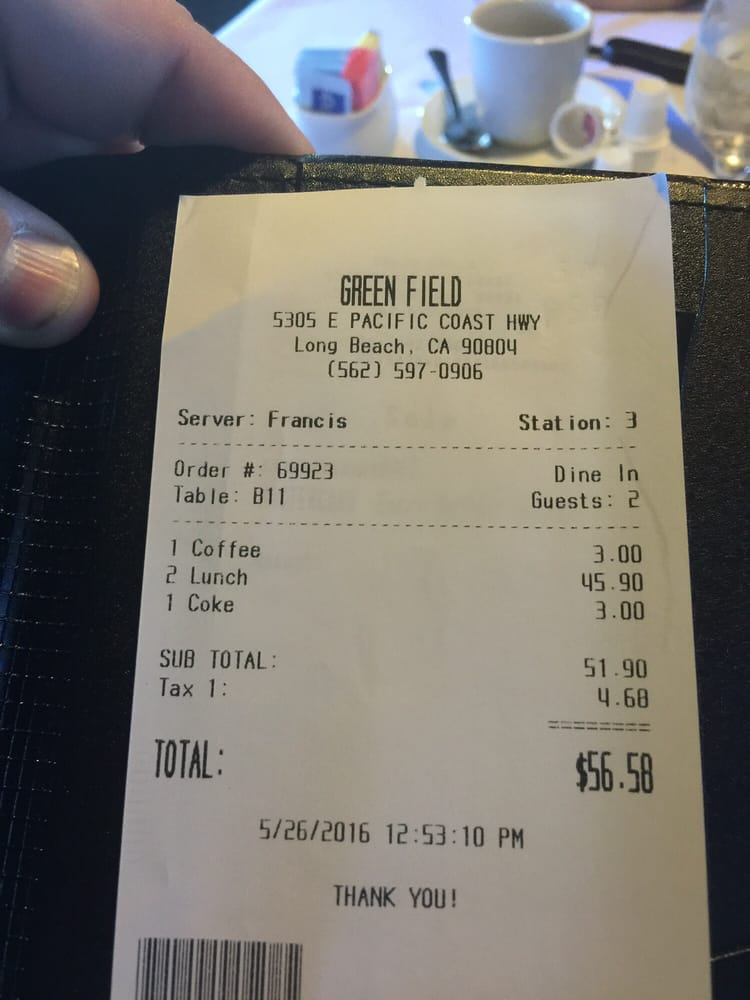
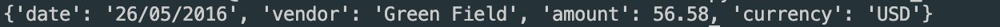
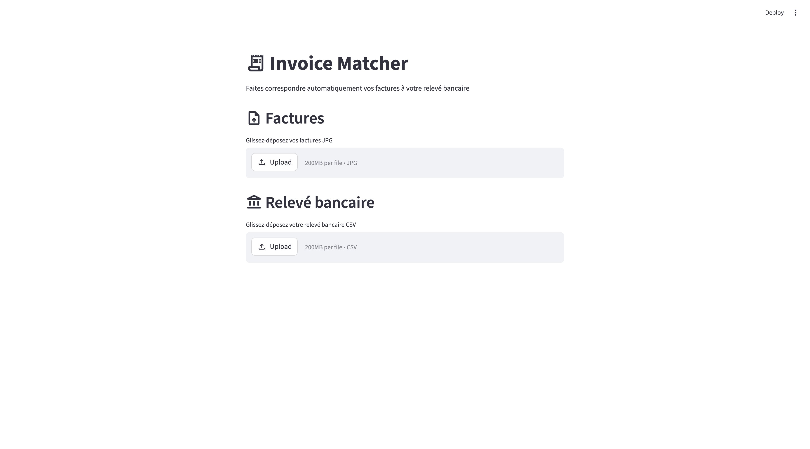
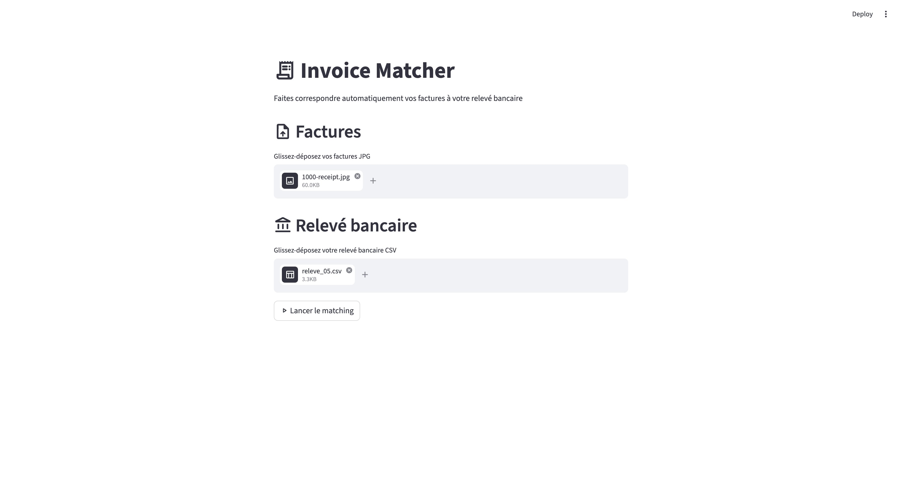
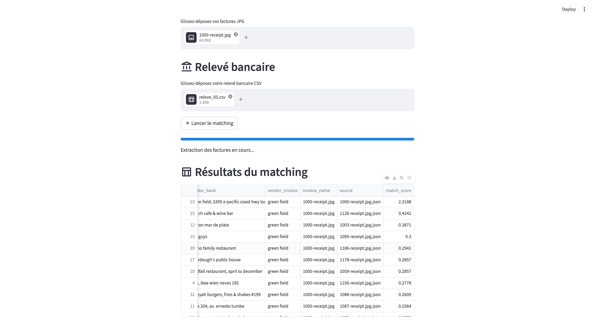

# Invoice Matcher

#### Matching automatique de factures avec relevé bancaire avce OCR multimodal 

---

## Motivation

Ce projet est un projet personnel, réalisé en dehors de tout cadre scolaire, dans le but d'approfondir mes connaissances en **computer vision appliquée à la compréhension de documents**.

Mes projets précédents portaient sur la construction de pipelines RAG et d'agents IA, ce qui m'a donné une bonne maîtrise du traitement du langage naturel et de l'orchestration de LLMs. Cependant, aucun de ces projets n'impliquait de données visuelles. J'ai donc initié ce projet pour explorer comment les modèles multimodaux peuvent extraire des informations structurées depuis des images brutes, et comment intégrer cette extraction dans un pipeline complet et utilisable.

---

## Présentation du projet

L'application prend en entrée un ensemble de **factures scannées** (format JPG) et un **relevé bancaire** (format CSV), et identifie automatiquement quelle facture correspond à chaque transaction bancaire.

**Entrées :**
- Une ou plusieurs images de factures (`.jpg`)
- Un relevé bancaire (`.csv`) avec les colonnes : `date`, `amount`, `currency`, `vendor`, `source`

**Sortie :**
- Un tableau de correspondances trié par score de confiance décroissant, avec les colonnes : `date`, `amount`, `vendor_bank`, `vendor_invoice`, `invoice_name`, `source`, `match_score`

---

## Pipeline

```
Images JPG (factures scannées)
            │
            ▼
 [LLM Multimodal — Llama 4 via Groq]
            │  Extrait : date, vendor, montant, devise
            ▼
  DataFrame structuré (factures)
            │
            ├─────────────────────────────────┐
            │                                 │
            ▼                                 ▼
  Relevé bancaire CSV               Prétraitement
            │                  (normalisation dates,
            │                   mise en minuscules vendors)
            └──────────────┬──────────────────┘
                           │
                           ▼
                   [Fuzzy Matching]
                           │
                           ▼
            Tableau de résultats trié par score
```

---

## Modules

### `invoice_extractor.py` — Extraction par LLM multimodal

C'est le cœur du projet. Ce module prend une image JPG de facture et retourne un dictionnaire Python structuré contenant les informations clés.

**Exemple concret :**

Image d'entrée :



Résultat retourné après traitement :



Le modèle lit l'image, comprend que `$56.58` est le total TTC (et non le numéro de table ou le sous-total), et retourne directement un JSON propre — sans aucun post-traitement manuel.

**Deux paramètres clés contrôlent la qualité de l'extraction :**

- `temperature=0` — Le modèle est entièrement **déterministe**. Pas de créativité, pas d'hallucination. On veut des faits extraits de l'image, pas des interprétations.
- `response_format={"type": "json_object"}` — Le modèle est forcé à répondre **uniquement en JSON valide**, directement parseable par `json.loads()` sans nettoyage.

**LLM multimodal vs OCR classique**

Un OCR classique (Tesseract, EasyOCR) lit l'image pixel par pixel et retourne du texte brut sans aucune compréhension sémantique. Il faudrait ensuite écrire des règles pour identifier ce qui est un montant, une date, un nom.

Ici on utilise **Llama 4 Scout**, un LLM multimodal servi via l'API Groq. Le modèle reçoit simultanément l'image et une instruction textuelle (le prompt), et retourne directement les données structurées. C'est ce qu'on appelle de la **document understanding**.

---

### `matching.py` — Rapprochement par fuzzy matching

Ce module compare chaque ligne du relevé bancaire avec l'ensemble des factures extraites, et calcule un score de correspondance sur trois critères :

| Critère | Type de comparaison                  | Score max |
| ------- | ------------------------------------ | --------- |
| Montant | Égalité exacte                       | 1.0       |
| Date    | Égalité exacte (après normalisation) | 1.0       |
| Vendor  | Similarité floue via `fuzz.ratio()`  | 1.0       |

**Score maximum possible : 3.0**

**Pourquoi le fuzzy matching ?**

Le nom d'un vendeur sur une facture scannée ne correspond jamais exactement au nom enregistré dans un relevé bancaire. Par exemple :

| Facture extraite     | Relevé bancaire                         | Score fuzzy |
| -------------------- | --------------------------------------- | ----------- |
| `Sonic`              | `Sonic America's Drive-In`              | ~85/100     |
| `Marco Pierre White` | `Marco Pierre White Steakhouse & Grill` | ~78/100     |
| `Sonic`              | `McDonald's`                            | ~10/100     |

`fuzz.ratio()` retourne un score de 0 à 100. On le divise par 100 pour obtenir une valeur entre 0 et 1, cohérente avec les autres critères.

**Normalisation des dates**

Les factures et les relevés bancaires utilisent des formats de date différents (`26/05/2016`, `2016-05-26`, `May 26 2016`...). Avant le matching, toutes les dates sont normalisées au format `YYYY-MM-DD` grâce à `pd.to_datetime()`, qui détecte automatiquement le format d'entrée.

---

### `main.py` — Extraction en batch

Ce script boucle sur les 200 images du dataset et appelle `invoice_extractor.py` pour chacune, puis sauvegarde les résultats dans `invoices_extraction.csv`.

**Sauvegarde progressive :** le CSV est écrit après chaque image traitée. Si le script est interrompu (rate limit, erreur réseau), les données déjà extraites ne sont pas perdues. Au relancement, si le CSV est incomplet, il est archivé et l'extraction repart depuis zéro.

---

### `app.py` — Interface Streamlit

Application web interactive permettant d'utiliser le pipeline sans ligne de commande.

---

## Utilisation de l'application

### Installation

```bash
git clone https://github.com/your-username/invoice-matcher.git
cd invoice-matcher
pip install -r requirements.txt
```

Créer un fichier `.env` à la racine :
```
GROQ_API_KEY=votre_clé_ici
```


### Lancement

```bash
streamlit run app.py
```

### Étapes d'utilisation

**Étape 1 — Interface vide au lancement**



**Étape 2 — Upload des fichiers**

Glissez-déposez vos factures JPG dans la zone "Factures" et votre relevé bancaire CSV dans la zone "Relevé bancaire", puis cliquez sur "Lancer le matching".



**Étape 3 — Résultats**

Le tableau s'affiche trié par `match_score` décroissant — les meilleures correspondances apparaissent en premier.




**Conseil :** Le dataset contient 6 fichiers de relevé bancaire (`releve_01.csv` à `releve_06.csv`). Testez chacun d'eux pour observer comment la qualité du matching varie selon le relevé. Les meilleurs scores indiquent que les noms de vendeurs sont bien renseignés dans ce relevé.

---

## Limitations connues

**Rate limit Groq :** Le tier gratuit de Groq est limité à 500 000 tokens par jour. Avec environ 2 500 tokens par image, cela permet de traiter environ 200 factures par jour. Sur ce projet, 118 factures sur 200 ont pu être extraites avec le tier gratuit avant d'atteindre la limite.

**Qualité des données :** Certaines entrées du relevé bancaire contiennent une adresse postale à la place du nom du vendeur (ex: `3768 Mission Blvd, San Diego, CA 92109`). Dans ces cas, le fuzzy matching sur le vendor est inefficace et le rapprochement repose uniquement sur le montant et la date. Il s'agit d'un problème de qualité des données sources, pas de l'algorithme.

---

## Stack technique

| Composant              | Technologie                |
| ---------------------- | -------------------------- |
| LLM multimodal         | Llama 4 Scout via API Groq |
| Fuzzy Matching         | RapidFuzz                  |
| Traitement des données | Pandas                     |
| Interface web          | Streamlit                  |
| Barre de progression   | tqdm                       |

---

## Structure du projet

```
invoice-matcher/
├── app.py                  # Application web Streamlit
├── invoice_extractor.py    # Extraction via LLM multimodal
├── matching.py             # Pipeline de fuzzy matching
├── main.py                 # Extraction en batch (200 images)
├── prompt.txt              # Prompt d'instruction pour le LLM
├── requirements.txt
```

---


## Pistes d'amélioration

### Idempotence de l'extraction

Actuellement, si le script `main.py` est interrompu à mi-chemin (rate limit, coupure réseau), il archive le CSV incomplet et recommence depuis zéro au relancement. Une amélioration naturelle serait de rendre le pipeline **idempotent** : au relancement, le script détecterait les images déjà traitées (via leur nom dans le CSV existant) et ne les soumettrait pas à nouveau à l'API. Cela éviterait de gaspiller des tokens et rendrait l'extraction reprise depuis exactement là où elle s'était arrêtée.

Cela passerait par l'encapsulation de la logique dans une **classe** avec un état interne, permettant de gérer proprement le cache des extractions déjà effectuées.

### Robustesse du matching

Le fuzzy matching actuel repose sur trois critères simples (montant, date, vendor). Pour rendre l'application utilisable sur n'importe quel relevé bancaire et n'importe quel jeu de factures, plusieurs améliorations seraient pertinentes :

- **Pondération adaptive des critères** — donner plus de poids au montant (critère le plus discriminant) et moins au vendor quand celui-ci est une adresse postale plutôt qu'un nom.
- **Détection automatique des adresses** — identifier les entrées de type adresse dans le relevé bancaire et désactiver le fuzzy matching sur le vendor dans ces cas précis.
- **Seuil de confiance configurable** — permettre à l'utilisateur de définir un score minimum en dessous duquel un match est considéré comme non fiable et affiché comme "non apparié".

### Support de formats variés

Actuellement le pipeline est calibré pour des factures JPG et des relevés CSV avec des colonnes spécifiques. Pour une adoption plus large :

- **Support PDF** — extraire les pages d'un PDF de factures avant de les soumettre au LLM.
- **Détection automatique des colonnes** — inférer les colonnes `date`, `amount`, `vendor` dans n'importe quel CSV, quelle que soit leur dénomination exacte.
- **Support multilingue** — le prompt actuel est en anglais ; le rendre multilingue permettrait d'extraire correctement des factures en français, espagnol, arabe, etc.

### Optimisation des coûts API

- **Mise en cache des extractions** — stocker les résultats dans une base de données légère (SQLite) indexée par le hash de l'image, pour ne jamais extraire deux fois la même facture.
- **Compression des images** — réduire la résolution des JPG avant envoi à l'API pour diminuer la consommation de tokens sans perte significative de qualité d'extraction.

---

*Projet personnel réalisé pour approfondir la computer vision et la compréhension de documents par les LLMs multimodaux.*